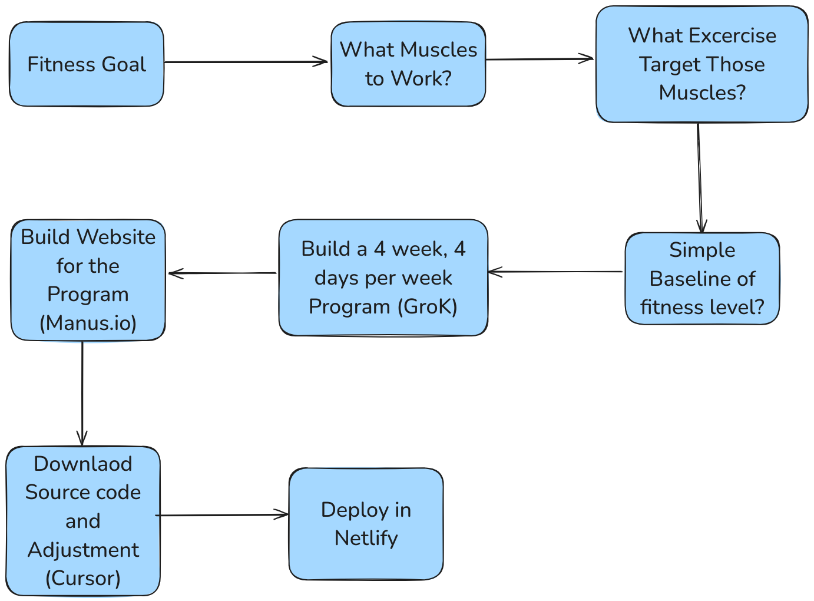

# Here is How I Hacked My Fitness With AI

- I will explain here to you  how to develop a fitness app with AI. It will be costumized, on teh web, foloow basic rule of fitness with tracking system. I think you can implement it in less than one hour. It Is fascinating to see how you can build such tools with AI, where a few yaesr ago it would be almost impossible. Lets get started:

## Workflow

This the teh workflow of how I build this web dasboard:

Essnetially, the workflow has three main blocks:

- The first one, is more to define goals, instruction and how to communicate with AI tool as it is Fitness Programmer
- In second, we use AI to generate the core of the webdabsoard simply with prompting
- Latsly, we need to adjust the source code, then deploy it on the web.

Lets get started.

### AI as Fitness Programmer

The first step to build this web dasboard is define our fitness goal to the AI. Here, I will use Grok3 to communcate with AI. After that I will ask AI to what muscles I need to work and what exercises I need to work on those muscles.