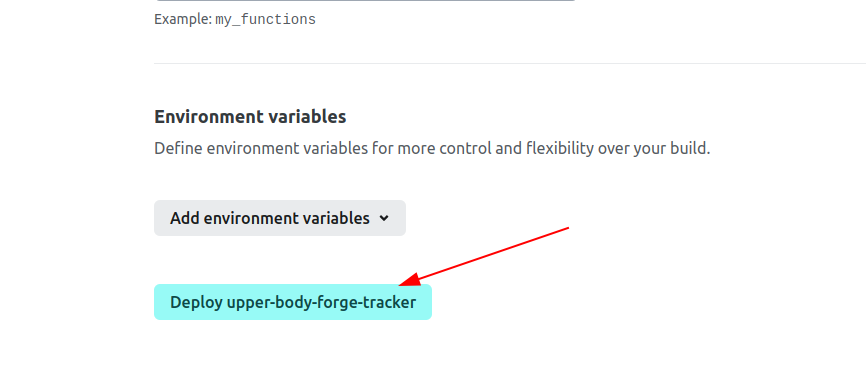

# How I Built a Custom AI Fitness App in Under 1 Hour

With the abundance of AI tools available today, I've built a few custom web dashboards for my personal and professional needs. You can now build web dashboards very quickly, even with minimal coding knowledge.

I believe more people should use AI to "build" something. When used correctly, AI acts as an "amplifier" of human creativity. In this blog post, I'll show you how I built a web dashboard for designing, monitoring, and tracking my fitness program. You can check it out here: [Fitness App](https://fitnessappdemo2025.netlify.app/)

{width="100%"}

My goal isn't to showcase how amazing the app is :) (it's not the best app in the world!), but rather to inspire you on how you can partner with AI tools to create something useful. I find joy in building on my ideas and sharing them with the world.

Here, first I will explain the overall workflow of how I built this web dashboard, broken down to steps.


## Workflow

This is the workflow of how I build this web dashboard:

{width="100%"}


Essentially, as you can see I am stacking up a few websites/tools to build this web dashboard. They all free to use. These tools are

- Grok3 as AI model for planning and brainstorming [Grok3](https://grok.com)
- Lovable as website builder [Lovable](https://lovable.dev)
- GitHub as code repository [GitHub](https://github.com)
- Cursor as code editor [Cursor](https://cursor.com)
- Netlify as tool to deploy the web dashboard [Netlify](https://netlify.com)

If this workflow feels overwhelming, you can start even more simply: just visit [Lovable](https://lovable.dev) and enter a prompt like "build a web dashboard for fitness program." This will give you a quick idea of how easy it is to get started building your own dashboard.

The workflow I recommend offers greater reliability and control—something I've refined through experience. In the following sections, I'll break down each step and show exactly how I leveraged AI to build this web dashboard.

This process is divided into three main phases:

- **Block 1 (Steps 1–3):** Define your fitness goals and communicate with the AI as your virtual fitness coach.
- **Block 2 (Steps 4–6):** Build the web dashboard using Lovable, turning your AI-generated program (Block 1) into an interactive, trackable platform.
- **Block 3 (Steps 7–9):** Deploy your web dashboard online with Netlify, making it accessible and easy to update or share.


Lets get started.

### Block 1 (Step 1-3): Defining Fitness Goal and designing Program

Here, first thing to do is to define the fitness goal. I think that is personal and you can define it as you want. Then, we use the AI to figure out what muscle/body part need to be developed to achieve that fitness goal. Then, figuring out what exercises are needed to develop those muscles.

I did some prompt engineering, and you can see the short version of my prompt to communicate with AI. Here I use Grok3 (www.grok.com) as AI model.


#### Step 1 and Step 2:

*Prompt to use with Grok3:*

```python

You are an expert strength and conditioning coach with extensive knowledge of muscle hypertrophy and body composition training.

My specific fitness goal: Develop a muscular, well-defined upper body with the classic "V-taper" physique (wide shoulders tapering to a narrow waist).

Please complete these tasks:

1. Identify the 5 most important muscle groups I need to prioritize for achieving this V-taper physique. For each muscle group, briefly explain why its crucial for this specific aesthetic goal.

2. Provide evidence-based support for your recommendations using brief parenthetical citations (e.g., research studies, established training principles).

Please think through this step-by-step, considering both the biomechanics of creating this aesthetic and the most effective training approaches.

```
You will get different reply from the grok3, depending on the fitness goal you have. Here is the reply I got:

```python
To achieve your goal of developing a muscular, well-defined upper body with the classic V-taper ...


Rest....

---

### 1. Latissimus Dorsi (Lats)
- **Why it’s crucial**: The lats are the primary muscles responsible for creating back width, a cornerstone of the V-taper. Well-developed lats give the upper body a wider, sweeping appearance that tapers down to the waist, forming the “V” shape. They are activated during pulling movements, which are essential for broadening the back.
- **Evidence**: Research shows that exercises like pull-ups and lat pulldowns effectively target the lats, promoting hypertrophy and width (Youdas et al., 2010).

### 2. Deltoids (Shoulders)
- **Why it’s crucial**: The deltoids, especially the lateral (side) heads, are critical for achieving broad shoulders, which enhance the upper body’s width and contrast with the waist. Strong, rounded delts create the wide-shouldered look that defines the V-taper.
- **Evidence**: Lateral raises and overhead presses are proven to stimulate the deltoids, with lateral raises particularly effective for the lateral heads responsible for shoulder width (Schoenfeld, 2010).

### 3. Trapezius (Traps)
- **Why it’s crucial**: The traps, particularly the upper and middle portions, add thickness and definition to the upper back. This enhances the V-taper by improving posture and creating a robust, muscular frame that complements the wide shoulders and lats.
- **Evidence**: Shrugs and rowing movements are highly effective for developing the traps, contributing to upper back mass (Ekstrom et al., 2003).

### 4. Pectoralis Major (Chest)
- **Why it’s crucial**: A well-developed chest, especially the upper portion, adds mass and fullness to the upper body, enhancing the overall muscular aesthetic. While not directly responsible for the V-shape, a strong chest creates a balanced, defined look that supports the wide shoulders and back.
- **Evidence**: Incline presses target the upper pectoralis major more effectively than flat presses, making them ideal for chest development (Barnett et al., 1995).

### 5. Biceps Brachii (Biceps)
- **Why it’s crucial**: The biceps contribute to the muscularity and definition of the upper body, complementing the broader shoulders and back. While not a primary driver of the V-taper, well-developed biceps enhance the overall aesthetic, making the arms appear proportionate and strong.
- **Evidence**: Bicep curls and similar isolation exercises are staples in bodybuilding for arm hypertrophy and aesthetic enhancement (established training principles).

---

### Additional Notes
While a narrow waist is essential for the V-taper, this is achieved more through body fat reduction (via calorie deficit) than hypertrophy of core muscles like the abs or obliques. Overdeveloping the obliques could widen the waist, counteracting the V-shape, so the focus here remains on upper body muscle groups. The combination of wide lats, broad deltoids, thick traps, a full chest, and defined biceps creates the muscular, well-defined upper body you’re aiming for.

---

### References
- Barnett, C., Kippers, V., & Turner, P. (1995). Effects of variations of the bench press exercise on the EMG activity of five shoulder muscles.
- Ekstrom, R. A., Donatelli, R. A., & Soderberg, G. L. (2003). Surface electromyographic analysis of exercises for the trapezius and serratus anterior muscles.
- Schoenfeld, B. J. (2010). The mechanisms of muscle hypertrophy and their application to resistance training.
- Youdas, J. W., et al. (2010). Surface electromyographic activation patterns and elbow joint motion during a pull-up, chin-up, or perfect-pullup™ rotational exercise.

By prioritizing these five muscle groups and training them with evidence-based exercises, you’ll build the V-taper physique you’re targeting. Let me know if you’d like a detailed workout plan to go along with this!

```


#### Step 3:

Now that we got list of muscle groups, that can help us to achieve goal we defined. Next step is to define the exercises that can help us to achieve the goal.

*Prompt to use with Grok3:*

```python
You are an expert strength and conditioning coach with extensive knowledge of muscle hypertrophy and body composition training.

My specific fitness goal: Develop a muscular, well-defined upper body with the classic "V-taper" physique (wide shoulders tapering to a narrow waist).                                                                                                             To achive To achieve my goal, I want to focus on these five msucles:  
1. Latissimus Dorsi (Lats)                                                                                       
2. Deltoids (Shoulders)
3. Trapezius (Traps)
4. Pectoralis Major (Chest)
5. Biceps Brachii (Biceps)

Please provide evidence-based recommendations for the two most effective exercises to target each of these muscle groups. For each exercise, include:

1. The exercise name
2. The equipment required (if any)
3. The biomechanics of the exercise
4. The research-based rationale for why this exercise is effective for the target muscle group

Please provide evidence-based recommendations for the two most effective exercises to target each of these muscle groups.Please think through this step-by-step.

```

After running the prompt, we get the reply from the grok3 as follows:

```python
V-Taper Exercise Plan
To achieve a muscular, well-defined upper body with the classic "V-taper" physique, focus on the following exercises targeting the latissimus dorsi (lats), deltoids (shoulders), trapezius (traps), pectoralis major (chest), and biceps brachii (biceps).
1. Latissimus Dorsi (Lats)
Wide-Grip Pull-Ups

Equipment: Pull-up bar
Biomechanics: Shoulder adduction and elbow flexion
Rationale: High lat EMG activity (Youdas et al., 2010)

Wide-Grip Lat Pulldowns

Equipment: Lat pulldown machine
Biomechanics: Shoulder adduction and elbow flexion
Rationale: Effective lat activation with adjustable resistance (Snyder & Leech, 2009)

rest...


```
So our virtual fitness coach has given us the list of exercises that we need to focus on.

A1: Wide-Grip Pull-Ups
A2: Wide-Grip Lat Pulldowns

B1: Overhead Dumbbell Presses
B2: Dumbbell Lateral Raises

C1: Dumbbell Shrugs
C2: Bent-Over Barbell Rows

D1: Incline Dumbbell Presses
D2: Flat Barbell Bench Presses

E1: Standing Barbell Curls
E2: Preacher Curls

## Block 2: Build Web Dashboard


##### Step 4 and 5:

The way program works is that it start with baseline level, and then you add the weight and reps in **progression** way. Therefore, you need some baseline fitnes level to start. In best way, you need to have baseline level of all the execrises. Though, that may not possible. What we can do is just give some basic data, and let AI model to extrapolate the baseline level for the rest of exercises. Here, for simplicty I am just giving two exercises (push up and pull up) and let AI model to extrapolate the baseline level for the rest of exercises. However, the more data you give here, the better the programming will be. 


  - Number of pushup you can do:
  - Number of pullups you can do:


With thes two data, we ask AI model to design the 4 weeks workout, with sets and reps for each exercise.

*Prompt to use with Grok3:*

```python

You are an expert strength and conditioning coach with extensive knowledge of muscle hypertrophy, body composition training, and periodized program design.

**My Current Fitness Level:**
- Maximum consecutive push-ups: 10
- Maximum consecutive pull-ups: 5
- Training experience: [Beginner/Intermediate - specify if known]

**Program Requirements:**
- Duration: 4 weeks
- Frequency: 4 training days per week
- Goal: Upper body muscle development and strength progression

**Available Exercises:**
A1: Wide-Grip Pull-Ups | A2: Wide-Grip Lat Pulldowns
B1: Overhead Dumbbell Presses | B2: Dumbbell Lateral Raises
C1: Dumbbell Shrugs | C2: Bent-Over Barbell Rows
D1: Incline Dumbbell Presses | D2: Flat Barbell Bench Presses
E1: Standing Barbell Curls | E2: Preacher Curls

**Please provide:**
1. A complete 4-week periodized program with:
   - Weekly progression strategy
   - Specific exercises, sets, and reps for each training day
   - For barbel weight and dumbbell weight, just estimate based on your knowledge given the baselien fitness level I have.

2. Brief rationale for:
   - Exercise selection and pairing
   - Weekly progression scheme

3. Recovery and progression guidelines:
   - How to progress when I can exceed the prescribed reps
   - What to do if I cannot complete the prescribed sets/reps
   - Recommended rest days between sessions

Format the program clearly with Week 1-4 layouts, making it easy to follow in the gym. Please think through this step-by-step.

```


I got the results as follows:

```python
Here’s a 4-week, 4-days-per-week upper-body program built around your equipment, current abilities, and “V-taper” goal. We’ll rotate two workouts (Pull-A and Push-B), each twice weekly, with linear load and rep adjustments.

---

## Overview

| Day     | Focus  | Workout             |
| ------- | ------ | ------------------- |
| Mon     | Pull-A | A2 → C2 → C1 → E1   |
| Tue     | Push-B | B1 → D2 → B2 → D1   |
| Wed     | Rest   | —                   |
| Thu     | Pull-A | A2/1 → C2 → C1 → E1 |
| Fri     | Push-B | B1 → D2 → B2 → D1   |
| Sat/Sun | Rest   | —                   |

* **Weeks 1–2**: Hypertrophy emphasis (8–12 RM), using lat-pulldowns (A2) to build volume.
* **Weeks 3–4**: Strength/hypertrophy mix (5–8 RM), swapping in bodyweight pull-ups (A1) for raw strength.

All weights given are starting loads approximated to leave \~2 reps in reserve at the top of the stated rep range.

---

## Week 1

### Pull-A (Mon, Thu)

| Exercise                       | Sets×Reps | Load                  |
| ------------------------------ | --------- | --------------------- |
| **A2 Wide-Grip Lat Pulldowns** | 4×12      | 60 kg                 |
| **C2 Bent-Over Barbell Rows**  | 4×12      | 60 kg                 |
| **C1 Dumbbell Shrugs**         | 4×15      | 2×40 kg (80 kg total) |
| **E1 Standing Barbell Curls**  | 3×12      | 30 kg                 |

### Push-B (Tue, Fri)

| Exercise                        | Sets×Reps | Load                  |
| ------------------------------- | --------- | --------------------- |
| **B1 Overhead Dumbbell Press**  | 4×12      | 2×8 kg (16 kg total)  |
| **D2 Flat Barbell Bench Press** | 4×12      | 60 kg                 |
| **B2 Dumbbell Lateral Raises**  | 4×15      | 2×5 kg (10 kg total)  |
| **D1 Incline Dumbbell Press**   | 4×12      | 2×10 kg (20 kg total) |

---

next weeks ....

```


#### Step 6

Now, finished our brainstorming for designing the program, we can move to the next step, which is to build the web dashboard. For building the dashboard, I will use the lovable.dev.


Here is a prompt you can use with lovable.dev (or similar AI dashboard builders) to generate a web dashboard:


**Prompt for AI Dashboard Generation:**


```python
You are an expert dashboard designer. Please generate a web dashboard for tracking a 4-week, 4-day-per-week upper body strength and hypertrophy program. The workout plan is as follows:

Here you give program you have generated in block 1.

**webdashboard Requirements:**

1. **Program Overview Section**
   - Display a summary of the 4-week program structure (days, split, focus).
   - Show a table or calendar view of the weekly workout schedule (Pull-A, Push-B, rest days).

2. **Workout Tracker**
   - For each training day, list the prescribed exercises, sets, reps, and suggested starting weights.
   - Allow users to log:
     - Actual sets, reps, and weights completed for each exercise.
     - Notes or comments per workout.
   - Automatically calculate and display weekly progression (e.g., +5% load, rep targets).

3. **Progress Visualization**
   - Graphs/charts to visualize:
     - Total volume per muscle group over time.
     - Progression in weights lifted for key lifts (e.g., bench press, pull-up, row).
     - Adherence to the program (workouts completed vs. scheduled).

4. **Personal Records & Baseline**
   - Section to input and display baseline fitness metrics (max push-ups, max pull-ups).
   - Highlight new personal bests as they are achieved.

5. **Recovery & Guidance**
   - Display rest day recommendations and recovery tips.
   - Show reminders for when to increase or decrease load based on performance.

6. **Mobile-Friendly Design**
   - Ensure the dashboard is responsive and easy to use on both desktop and mobile devices.

**Data Model:**
- User profile (name, baseline metrics)
- Workout log (date, workout type, exercises, sets, reps, weights, notes)
- Progress data (volume, PRs, adherence)

**Style:**
- Clean, modern, and motivating.
- Use color coding for different muscle groups or workout types.

---

Please generate the dashboard code or configuration to implement this functionality, using best practices for usability and fitness tracking.
```
 After running the prompt, and perhaps do some adjustment, probably you can get the working version of your web dashboard. Now, at this step we can move to Block 3, which is deploying the web dashboard on the web.

### Block 3: Deploy the web dashboard


##### Step 7

So after the bulk of webdashboard is done, I like to push my coe to Github repo, so that I can **fine-tune** it more in your favorite IDE, Cursor for example. To do that, you just need to go top right of the Lovable and click on the **Github** icon.


#### Step 8

After that, I can bring the repo to the Cursor IDE, or Copilot IDE, or any other IDE that you like. Now the code is lcoally available, and under version control. I find that I can strat nicely to build bulk of things with Lobvobale fist, then bring it to the IDE  so can I can fine-tune it more.

You need to run flowlwing code to run websdashbiad lcoally:

```bash
npm install
npm run dev
```

Then, yoy will get everthug ready isnide your cirsor. 


#### Step 9


For deployment, I use the free version of Netlify. I found it it is very simple website to deploy your website, and it is very easy to use. You just need to follow these steps:

- Go to "Project"
- Click on "Add new project"
- Select "Import an existing project"
- Select "GitHub"
- Select the repository you want to deploy (the webdashboard repo)
- Click on "Deploy"





After that, you will get a link to your website. You can share it with your friends and family.


