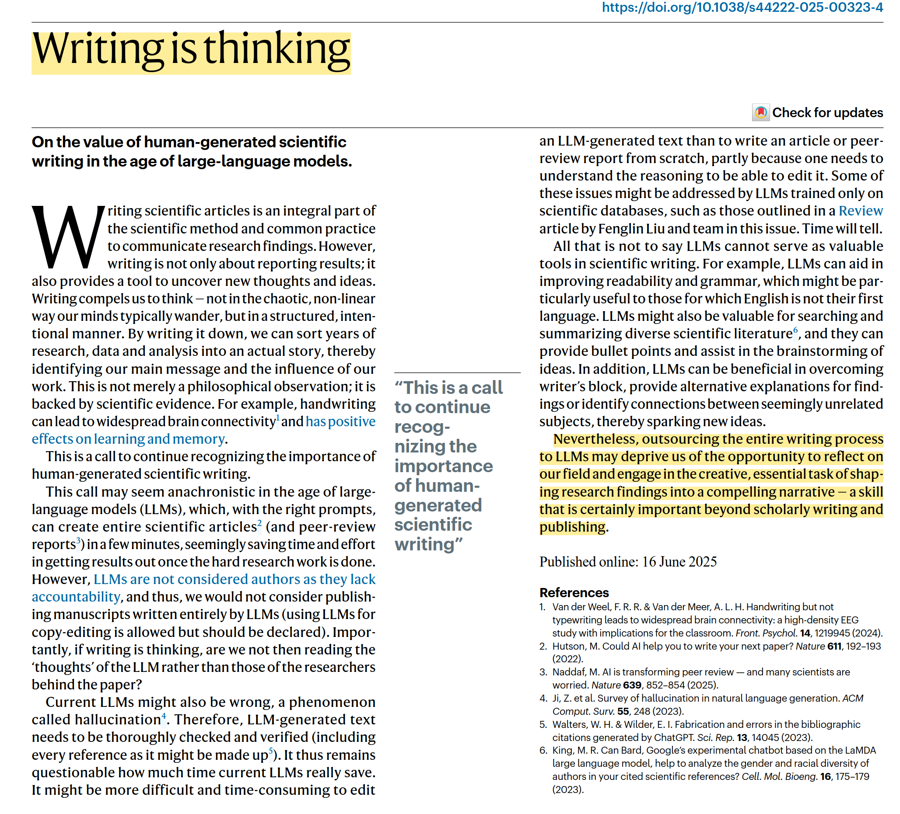

# On "Writing is Thinking"

Writing, especially writing on the internet, has helped me in many ways:

1) Writing helped me realize when I didn’t fully understand a topic. As I start to write, I discover gaps in my knowledge. Writing pushes me to clarify my thinking and understand topics more deeply.

2) It helped me identify topics that intersect between three circles:

- What topic I like to read/write about
- what topic I am good at 
- What topic are in demand in the market

  <svg width="420" height="320">
    <!-- Circle 1: Like to read/write -->
    <ellipse cx="160" cy="170" rx="110" ry="80" fill="skyblue" fill-opacity="0.5"/>
    <text x="100" y="180" text-anchor="middle" alignment-baseline="middle" font-size="10" font-weight="bold" fill="#222">
      What topic I like to
    </text>
    <text x="100" y="190" text-anchor="middle" alignment-baseline="middle" font-size="10" font-weight="bold" fill="#222">
      read/write
    </text>
    <!-- Circle 2: What topic I am good at -->
    <ellipse cx="260" cy="170" rx="110" ry="80" fill="lightgreen" fill-opacity="0.5"/>
    <text x="300" y="180" text-anchor="middle" alignment-baseline="middle" font-size="10" font-weight="bold" fill="#222">
      What topic I am
    </text>
    <text x="300" y="190" text-anchor="middle" alignment-baseline="middle" font-size="10" font-weight="bold" fill="#222">
      good at
    </text>
    <!-- Circle 3: Market demand -->
    <ellipse cx="210" cy="90" rx="110" ry="80" fill="pink" fill-opacity="0.5"/>
    <text x="210" y="72" text-anchor="middle" alignment-baseline="middle" font-size="10" font-weight="bold" fill="#222">
      What topic are in
    </text>
    <text x="210" y="88" text-anchor="middle" alignment-baseline="middle" font-size="10" font-weight="bold" fill="#222">
      demand in the market
    </text>
    <!-- Intersection: All Three -->
    <text x="210" y="150" text-anchor="middle" alignment-baseline="middle" font-size="16" font-weight="bold" fill="red">
      All Three
    </text>
  </svg>

3) Whenever I want to reach out to a new client or potential employer, I can simply send them a link to my blog or articles. My writing serves as a portfolio that showcases my skills and knowledge far better than just describing them (in CV for example).

4) Most importantly, it helped me to get connected and find new "intellectually aligned" friends, all over the world, that would be impossible to do without writing.

Though we are in the age of AI, where AI writing is everywhere (which I never enjoyed reading them!), I do believe human writing is becoming even more important.

Human writing give "taste" to the text. It is like soul of the text. It has human touch that distinguishes it from AI writing. Creative, human writing is a process that make we our stand out from "soulless" AI writing.

I really enjoyed this short editorial from the Nature:

[https://www.nature.com/articles/d41586-025-02191-0](https://www.nature.com/articles/s44222-025-00323-4)

I think it is a concise summary and well worth reading.

